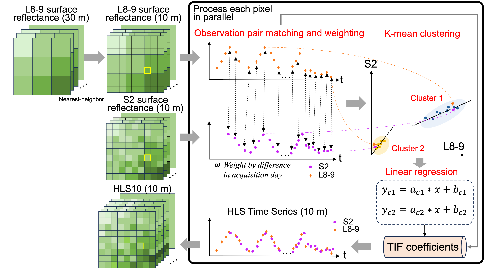

# TIF: Time-series-based Image Fusion

Welcome to the **TIF** repository! This package includes the source code and examples of the **Time-series-based Image Fusion (TIF)** algorithm. The TIF algorithm was developed to produce 10 m Harmonized Landsat and Sentinel-2 (HLS) data by fusing 30 m Landsat 8-9 and 10 m Sentinel-2 A/B time series.



## Table of Contents

- [Overview](#overview)
- [Features](#features)
- [Installation](#installation)
- [Usage](#usage)
- [Examples](#examples)
- [Contributing](#contributing)
- [Acknowledgements](#acknowledgements)


## Overview

The TIF algorithm is designed to enhance the spatial resolution of **Landsat 8-9 imagery** from 30 m to 10 m by leveraging the higher resolution **Sentinel-2** data. This method can be used to generate **fine-resolution dense time series**, i.e. 10 m Harmonized Landsat and Sentinel-2 (HLS) data.

## Features

- **Spatial Resolution Enhancement:** Improve Landsat 8 imagery resolution from 30 m to 10 m on any given date.
- **Pixel-level Sensor-to-sensor Adjustment:** Harmonize data from different satellite sources without bandpass adjustment.
- **Robust Performance:** Demonstrated robustness to temporal changes and varying land cover types.
- **Parallel Computing Support:** Accelerated by using massive computing cores.

## Installation

To install the TIF package, you can clone the repository and ensure you have the required MATLAB toolboxes: [Mapping Toolbox](https://www.mathworks.com/products/mapping.html) and [Statistics and Machine Learning Toolbox](https://www.mathworks.com/products/statistics.html).


```bash
git clone https://github.com/yourusername/TIF.git
```

## Usage
To use the TIF algorithm, follow these steps:

1. Prepare your Landsat 8 and Sentinel-2 time series data (save to **pixels** for sample-based analysis, save to **lines** for ROI-based analysis).
2. Conduct the TIF algorithm to obtain TIF coefficient for each spectral band.
3. Use the TIF coefficients to fuse the Landsat data and produce 10 m HLS time series.

Here's an example script to get you started:

## Examples
We have included several demos in the examples directory to demonstrate the usage of the TIF algorithm. These examples cover different scenarios and use cases, helping you understand how to apply the algorithm to your own data.

### Example 1: Basic Usage 
[Example 1_BasicUsage](https://github.com/kathy9980/TIF/blob/main/Examples/Example1_BasicUsage.m) demonstrates the basic usage of the TIF algorithm on a single pixel. Here's a brief overview of the script.
```matlab
addpath(genpath('path_to_TIF_functions')); 

%% Load example data
data = load('Examples/Data/T18TXM_Lat_42.1566_Lon_-72.5847.mat');
L8_metadata = load('Examples/Data/L8_metadata.mat');
S2_metadata = load('Examples/Data/S2_metadata.mat');

%% Initialize the TIF algorithm 
TIF_coefficient = runTIFSinglePixel(data, L8_metadata, S2_metadata, 'do_plot', true);

%% Run the fusion process to the time series
[clrx_L, prediction, clrx_S, clry_S] = predictClearSurfaceReflectanceTS(data, TIF_coefficient);

%% Merge Sentinel-2 and the predction values
[clrx_HLS, HLS_10m] = mergeL10S10TimeSeries(clrx_S, clry_S, clrx_L, prediction);

%% Display the results
band_plot = 6; 
plot10mHLSTimeSeries(clrx_S, clry_S, clrx_L, prediction, band_plot);
```


### Example 2: Advanced Usage
[Example 2_Advanced Usage](https://github.com/kathy9980/TIF/blob/main/Examples/Example2_AdvancedUsage.m) shows advanced TIF conduction with user-defined parameters.
```matlab
%% TIF with modified paramters of t_threshold, maxK, regress_method, and wfun
TIF_coefficient = runTIFSinglePixel(data, L8_metadata, S2_metadata,...
    't_threshold',1,'maxK',1,'regress_method','robustfit','wfun','Sqrt',...
    'msg', true,'do_plot', true,'save_figure',false);
```

### Example 3. TIF with Parallel Computing
The [bashTIF.sh](https://github.com/kathy9980/TIF/blob/main/HPCJobs/batchTIF.sh) shows how to perform the TIF algorithm with imagery time series on the UConn HPC. Here's a brief overview of the script.

```bash
#!/bin/bash
#SBATCH --partition=general
#SBATCH --account=add-your-account
#SBATCH --ntasks=2
#SBATCH --array=1-60
#SBATCH --output=TIF_T18TXM.out
#SBATCH --mail-type=ALL
#SBATCH --mail-user=add-your-email-address

echo $SLURMD_NODENAME
cd add-your-TIF-directory

module load matlab
matlab -nojvm -nodisplay -nosplash -singleCompThread -r "batchTIF('task',$SLURM_ARRAY_TASK_ID, 'ntasks',$SLURM_ARRAY_TASK_MAX, 'ARDTiles','18TXM','hide_date','2021-06-16','analysis_scale','30to10');exit"
```

In this bash file, we applied the TIF algorithm to a subarea of T18TXM using 60 cores. Note: The input data area in the BIP format. Each line contains the time series of a subset image with 10 rows and 10980 cols on each row. To prepare your own input, run the [StackS2Data.m]().


To submit a HPC job, use the command below.
```linux
submit batchTIF.sh
```

## Contributing
We welcome contributions to the TIF project! If you would like to contribute, please follow these steps:

1. Fork the repository.
2. Create a new branch for your feature or bugfix.
3. Commit your changes and push the branch to your fork.
4. Submit a pull request to the main repository.

## Acknowledgement
Reference: Our research paper **"TIF: Time-series-based Image Fusion Algorithm"** is submitted to the *Remote Sensing of Environmet* for review.


If you have any questions, please contact Zhe Zhu (zhe@uconn.edu) and Kexin Song (kexin.song@uconn.edu) at Department of Natural Resources and the Environment, University of Connecticut.


